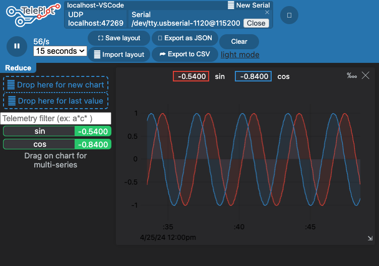

# วาดกราฟ ใน vscode ให้เหมือน Serial plotter ใน Arduino ทำอย่างไร


หลาย ๆ ท่านที่เคยใช้ Arduino IDE อาจพอจะคุ้นเคยกับ integrated tool ชื่อว่า `Serial plotter` กันมาบ้างแล้ว เพียงแค่เขียนโค้ดให้ Arduino ส่งข้อมูลออกมาผ่าน Serial โดยให้มีค่าตัวเลขและขึ้นบรรทัดใหม่ หรือตัวเลข+ตัวคั่นเช่น `\t`, `เว้นวรรค`, `,` + ตัวเลข + ขึ้นบรรทัดใหม่ กรณีให้แสดงผลสองค่าพร้อมกัน แล้วเปิด Serial plotter ขึ้นมา ก็สามารถดูกราฟของข้อมูลที่ส่งออกมาได้เลย

```cpp
#include <Arduino.h>

void setup()
{
    Serial.begin(115200); 
}

float i = 0;
void loop()
{
    i += 0.1;

    Serial.print(sin(i));
    Serial.print("\t");
    Serial.println(cos(i));
    delay(50);
}

```


ซึ่งการใช้งาน Serial plotter นั้นเป็นเรื่องที่สะดวกและง่ายมาก แต่ในกรณีที่เราต้องการใช้ vscode ในการเขียนโค้ด และต้องการดูกราฟของข้อมูลที่ส่งออกมา จะต้องทำอย่างไรบ้าง ในบทความนี้จะมาแนะนำวิธีการใช้งาน `Plot` ใน vscode ให้เหมือนกับ Serial plotter ใน Arduino IDE กัน

## วิธีการใช้งาน

1. ติดตั้ง extension `Teleplot` ใน vscode โดยไปที่ `Extensions` แล้วค้นหา `Teleplot` แล้วกด install


จะเห็นว่าหลังจากที่ติดตั้งเสร็จแล้ว จะมี icon ของ `Teleplot` ขึ้นมาทางด้านซ้ายมือของ vscode ดังรูปด้านล่าง


2. ลองเขียนโค้ดตัวอย่างด้านล่างนี้ เป็นการวาดกราฟ sine wave และ cosine wave โดยใช้ `Teleplot` ใน vscode

```cpp
#include <Arduino.h> 
void setup() {
  Serial.begin(115200);
  // Print log
  Serial.println("setup");
}

float i=0;
void loop() {
  i+=0.1;

  // Print log
  Serial.print("loop");
  Serial.println(i);
  
  // Plot a sine
  Serial.print(">sin:");
  Serial.println(sin(i));

  // Plot a cos
  Serial.print(">cos:");
  Serial.println(cos(i));
    
  delay(50);
}
```


กดอัพโหลด

3. กดที่ icon `Teleplot` ที่อยู่ทางด้านซ้ายมือของ vscode จากนั้นเลือก port ที่เชื่อมต่อกับ Arduino เลือก baudrate เป็น 115200 แล้วกด `Open`


4. หลังจากกด `Open` แล้ว จะเห็นกราฟ sine wave และ cosine wave ที่ถูกวาดขึ้นมาใน vscode แล้ว


จะสั่งเกตว่าในโค้ด เพื่อให้ teleplot แสดงกราฟออกมา ต้องใช้ฟอร์แมท

```>ชื่อตัวแปร:ค่าตัวแปร\n``` 

ในกรณีข้อมูลที่ส่งออกมีหลายตัวแปร ให้เราใช้ฟอร์แมทเดียวกันนี้ในบรรทัดใหม่เช่นกันเช่น
```
>val1: 12345
>val2: 0.12345
```

สำหรับข้อมูลอื่น ๆ ที่ไม่ได้อยู่ในฟอร์แมทนี้ จะถูกเก็บเป็น log ด้านขวามือ


5. ทดลองปิดหน้าต่าง cos แล้วลากจากไอคอนซ้ายมือไปวางทับหน้าต่าง sin


เท่านี้เราก็จะได้กราฟที่เหมือนกับ Serial plotter ใน Arduino IDE แล้ว





นอกจากนี้ยังสามารถลากเมาส์ในกราฟเมื่อซูมค่าได้ด้วย ในขณะที่กดซูม การพรอตจะถูกหยุดไว้ เราสามารถกดปุ่ม play ด้านบนเพื่อเริ่มการพรอตใหม่อีกครั้ง
และยังสามารถเลือกระยะเวลาที่จะแสดงในกราฟได้ด้วย เช่น จากขอบซ้ายมือไปขวามือของการพรอตกว้างกี่วินาที ใช้สำหรับการเลือกดูข้อมูลในช่วงเวลาที่เราสนใจ


## สรุป

การใช้งาน `Teleplot` ใน vscode นั้นสามารถช่วยให้เราดูข้อมูลที่ส่งออกมาจาก Arduino ในรูปแบบของกราฟได้ และยังสามารถดูข้อมูลที่ส่งออกมาในรูปแบบของ log ได้อีกด้วย ซึ่งเป็นเรื่องที่สะดวกและง่ายต่อการใช้งาน แถมยังเพิ่มเติมความสามารถที่ Serial plotter ทำไม่ได้อีกมากมาย ใครที่มองหาเครื่องมือที่สามารถดูข้อมูลที่ส่งออกมาจาก Arduino ในรูปแบบของกราฟ และ log แนะนำให้ลองใช้ `Teleplot` ใน vscode ดูครับ


